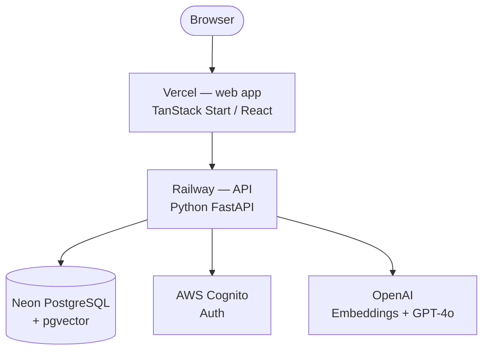

# Beerolog

Beer recommendation and social expert app. Take a short quiz, get three beers matched to your taste profile. Rate what you drink to evolve your profile over time.

## Architecture



## Monorepo layout

| Directory | Purpose |
|---|---|
| `apps/web` | TanStack Start (React + Vinxi) frontend, deployed on Vercel |
| `apps/api` | FastAPI backend, deployed on Railway |
| `packages/types` | Shared TypeScript types and FlavorVector contract |
| `packages/db` | Drizzle ORM schema + migrations (Neon PostgreSQL) |
| `packages/ui` | Shared React component library |

## Prerequisites

- **Node** 20+
- **pnpm** 11+ (`npm i -g pnpm`)
- **Python** 3.12+

## Quick start

```bash
# 1. Install JS dependencies
pnpm install

# 2. Configure the API
cp apps/api/.env.example apps/api/.env
# Edit apps/api/.env and fill in all required values

# 3. Configure the web app
cp apps/web/.env.local.example apps/web/.env.local
# Edit apps/web/.env.local — set VITE_API_URL=http://localhost:8000 for local dev

# 4. Set up the API Python environment
cd apps/api
uv sync --extra dev
cd ../..

# 5. Run migrations
pnpm db:migrate

# 6. Start everything
pnpm dev          # web app (http://localhost:3000)
# In a separate terminal:
cd apps/api && uv run uvicorn app.main:app --reload
```

## Verification

```bash
pnpm typecheck
pnpm lint
pnpm test
```

## Further reading

- [API setup](apps/api/README.md)
- [Web app setup](apps/web/README.md)
- [Architecture](docs/architecture.md)
- [AWS Cognito](docs/services/cognito.md)
- [Neon PostgreSQL](docs/services/neon.md)
- [OpenAI](docs/services/openai.md)
- [Railway (API deployment)](docs/services/railway.md)
- [Vercel (web deployment)](docs/services/vercel.md)
