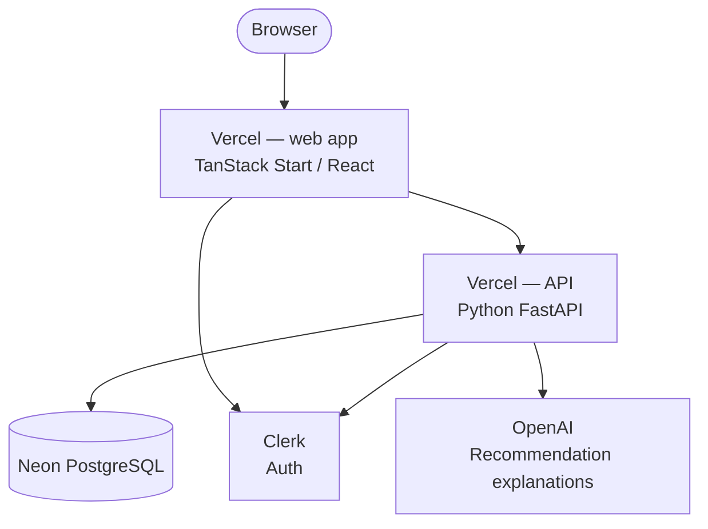

# Beerolog

Take a short quiz, get beers matched to your taste profile, rate what you drink,
and watch the profile move. Live at **[beerolog.com](https://beerolog.com)**.

This is the public source of the consumer product — the taste model, the
two-stage ranker, the quiz, the menu scanner, the rating feedback loop and the
web client. Built and maintained by one engineer.

> **What is not here.** The operator side — the staff and venue portal (`apps/portal`),
> org and member management, in-venue ordering, QR flows, availability signals,
> the catalog scrape pipeline and moderation tooling — is not published. It has
> been removed from every commit, not just from the tip, so `git log` will not
> turn it up. The catalog's beer photography is third-party and not
> redistributable, so it is absent as well; the UI falls back to generated
> icons. Everything that remains builds, typechecks, and passes its tests.

## What is worth reading

- **`apps/api/app/services/match_engine.py`** — the ranker. A weighted cosine
  merge of a long-run taste embedding and a tonight's-mood embedding, a signed
  novelty re-rank, an ABV band term, and a graded avoid-penalty that down-ranks
  rather than filters.
- **`apps/api/app/services/baseline_taste.py`** — quiz answers become a synthetic
  preference sentence *and* the user-facing dials from a single source, so what
  the model scores and what the UI shows cannot drift apart.
- **`apps/api/app/services/dial_match.py`** — a second, embedding-free matcher in
  12-dimensional dial space, for the signed-out preview.
- **`apps/api/app/services/menu_scanner.py`** / **`menu_chat.py`** — photograph a bar
  menu, resolve the entries against the catalog with a fuzzy matcher, rank them
  against your profile.
- **`apps/api/tests/eval/`** — a persona harness reporting precision@5 and MRR,
  plus live probes for cross-lingual retrieval and hop-name semantics.
- **`docs/adr/`** — the architecture decisions, including the two-layer taste
  model and the auth boundary.

## Architecture



## Monorepo layout

| Directory | Purpose |
|---|---|
| `apps/web` | TanStack Start (React + Vinxi) frontend, deployed on Vercel |
| `apps/api` | FastAPI backend, deployed on Vercel (separate `beerolog-api` project) |
| `packages/types` | Shared TypeScript types and FlavorVector contract |
| `packages/db` | Drizzle ORM schema + migrations (Neon PostgreSQL) |
| `packages/ui` | Shared React component library |

## Prerequisites

- **Node** 20+
- **pnpm** 11+ (`npm i -g pnpm`)
- **Python** 3.12+

## Quick start

```bash
# 1. Install JS dependencies
pnpm install

# 2. Configure the API
cp apps/api/.env.example apps/api/.env
# Edit apps/api/.env and fill in the required values for DB, OpenAI, Clerk, and CORS

# 3. Configure the web app
cp apps/web/.env.local.example apps/web/.env.local
# Edit apps/web/.env.local — set VITE_API_URL=http://localhost:8000 for local dev

# 4. Set up the API Python environment
cd apps/api
uv sync --extra dev
cd ../..

# 5. Run migrations
pnpm db:migrate   # provisions the supported MVP persistence tables

# 6. Start everything
pnpm dev          # web app (http://localhost:3000)
# In a separate terminal:
cd apps/api && uv run uvicorn app.main:app --reload
```

## Verification

```bash
pnpm typecheck
pnpm lint
pnpm test
```

## Supported MVP After Cleanup

- Canonical supported journey: signed-in, profile-centered solo flow
- Authoritative recommendation path: API `/recommendations`
- Deferred from the cleaned MVP: venue/scan flows, group sessions, friend challenges, leaderboards/social proof, badges, and broader bar tooling/operator workflows
- Launch/runtime config: API CORS, log level, and environment are configured via `APP_ENV`, `CORS_ALLOWED_ORIGINS`, and `LOG_LEVEL`

## Further reading

- [API setup](apps/api/README.md)
- [Web app setup](apps/web/README.md)
- [Architecture](docs/architecture.md)
- [Operational artifacts](docs/ops/README.md)
- [Clerk (authentication)](docs/services/clerk.md)
- [Neon PostgreSQL](docs/services/neon.md)
- [OpenAI](docs/services/openai.md)
- [Vercel (API deployment)](docs/services/vercel-api.md)
- [Vercel (web deployment)](docs/services/vercel.md)


## License

MIT — see [LICENSE](LICENSE). The license covers the source in this repository.
Beer, brewery and venue names appearing in fixtures and tests belong to their
respective owners.
